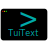

# README.md

[![MIT License][license-shield]][license-url]

<!-- PROJECT LOGO -->
 

  
<h3 align="center"> Echto - Text Editor ~ AchroDev </h3>

  

    This is a custom text editor I am currently writing while following the guide in the acknowledgements. Please feel free to clone the repository and test it out.
     
  

> [!WARNING]  
> At somewhere around chapter 5-6 this editor quit taking input, at chapter 7 before finishing the comment highlighting, the editor hangs when opening a file. This project is being put on the side for now until the new guide is finished or I feel experienced enough to rewrite it.

<!-- ABOUT THE PROJECT -->
## About The Project
![MadeForBadge][made-for-link]

![EchtoSS1][screenshot]
![EchtoSS2][screenshot2]

# 

## Table of Contents

> 1. [Source][source]   
> 2. [Instructions][instructions] 
> 3. [Acknowledgements][acknowledgements]  
#

## Instructions
>
> Find:  
> `Ctrl-F`  
> Save:  
> `Ctrl+S`  
> Quit:  
> `Ctrl+Q`

<!-- ACKNOWLEDGEMENTS -->
## Acknowledgements
* [Hecto: Build your own text editor][hecto-guide]
* [README template][readme-template]
* [Rust-lang][rust-lang]
* [The Rust Programming Language (Book)][rust-book]
* [Same as above but by Brown University with quizzes built-in][rust-book-brownuni]

<!-- MARKDOWN LINKS & IMAGES -->
<!-- https://www.markdownguide.org/basic-syntax/#reference-style-links -->
[license-shield]: https://img.shields.io/github/license/AchroDev/AchroDev.svg?style=for-the-badge
[license-url]: https://github.com/AchroDev/echto/blob/main/LICENSE.txt
[made-for-link]: https://img.shields.io/badge/GNU%20Bash-4EAA25?style=for-the-badge&logo=GNU%20Bash&logoColor=white
[source]: /src
[screenshot]: /images/screenshot.png
[screenshot2]: /images/screenshot2.png
[hecto-guide]: https://archive.flenker.blog/hecto/
[readme-template]: https://github.com/othneildrew/Best-README-Template
[rust-lang]: https://www.rust-lang.org/
[rust-book]: https://doc.rust-lang.org/stable/book/
[rust-book-brownuni]: https://rust-book.cs.brown.edu/
[instructions]: https://github.com/AchroDev/echto?tab=readme-ov-file#instructions
[Acknowledgements]: https://github.com/AchroDev/echto?tab=readme-ov-file#acknowledgements